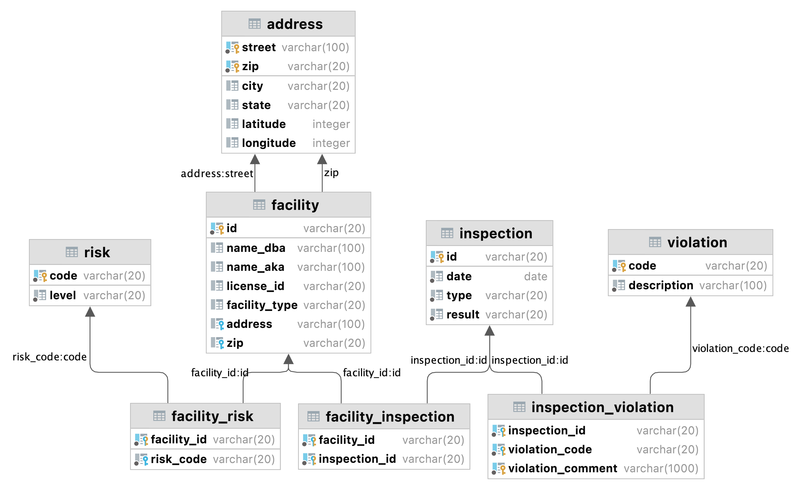

# Chicago Food Inspection

In this project, we will work on the Chicago Food Inspection dataset.
(Data source: https://www.kaggle.com/datasets/chicago/chi-restaurant-inspections)

The Chicago Food Inspection dataset was collected by the City of Chicago Department of Health, spanning 4 years and half (1/2/2013 - 8/28/2017). Food inspections of restaurants ensure food safety to the public and recognize violations and potential risks. All restaurants are subject to regular inspections annually, as well as in response to a complaint, to ensure continued compliance with regulations.

This dataset contains 153,810 rows and 17 columns. Each row represents one inspection record, and includes basic information of the food facility (such as facility name and type, license number, address information, geographic coordinates) and inspection information (such as inspection ID, date, type, result, risk and violation).

ER Diagram:

